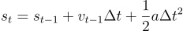
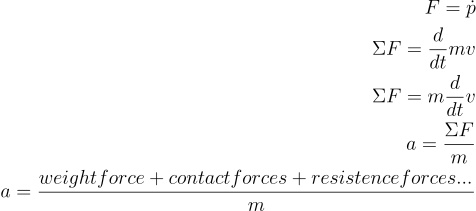
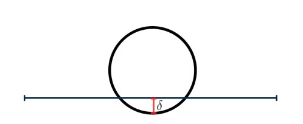
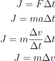
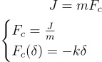
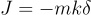

# Elastic and non elastic collision implementation

Final project for *Mathematical and Computational Modeling discipline* (Physics I with long name) at UFRJ.

The project is basically a simulation of physics using three main *tools*: 

- **Impulse based method:** move the objects out of penetration using instantaneous impulses (changes in velocity) to prevent objects from interpenetrating.
- **Direct Integration**: Each simulation step is calculated from previous step. Ex: if we want the results of simulation at step 10, we need to calculate step 9, 8, 7, 6,...

The main idea is that if we can describe all forces in a given object at a given time-step, we can apply a proper acceleration to it and let the system play. Consider the position equation bellow:

t-index as time-step

By newton's second law, we know that forces impressed on a body is equal to the derivate of momentum (rate of change of momentum):

To describe the contact force we need to consider that, in nature, all objects have the ability of deformation and restitution, we are insterested on its restitution capability. 

given:

- \delta: penetration in pixels per seconds (also known as velocity) of contact
- k: coeficient of restitution from 0 (no restitution) to 1 (perfect elastic collision), less than 1 is non elastic collision.
- J: impulse

Deriving the impulse based method:

So the impulse implied to a body is the solution of the given system

Simple case: On a head on collision with the ground the object A is going to hit with v = 10 m/s (\delta). The solid ground is going to restore all deformation (because its solid) and for simplicity so the object (so k = 1 + 1), the ground will also not move (so its going to push the object).

J = -2 * m_a * v 

Oblique collision: 

This method is also used in many games.
