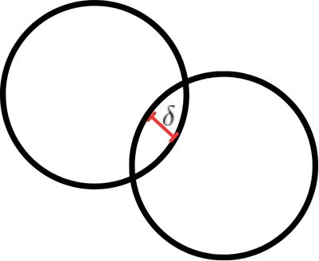

# Elastic and non elastic collision implementation

Final project for *Mathematical and Computational Modeling discipline* (Physics I with long name) at UFRJ.

The project is basically a simulation of physics using three main *tools*: 

- **Impulse based method:** move the objects out of penetration using instantaneous impulses (changes in velocity) to prevent objects from interpenetrating.
- **Direct Integration**: Each simulation step is calculated from previous step. Ex: if we want the results of simulation at step 10, we need to calculate step 9, 8, 7, 6,...

The main idea is that if we can describe all forces in a given object at a given time-step, we can apply a proper acceleration to it and let the system play. Consider the position's equation 

$$s_t = s_{t-1} + v_{t-1} \Delta t + \frac{1}{2} a \Delta t^2$$
$$\text{t-index as time-step}$$

By newton's second law, we know that forces impressed on a body is equal to the derivate of momentum (rate of change of momentum):

$$F = \dot{p}$$
$$\Sigma F = \frac{d}{dt} m v$$
$$\Sigma F = m \frac{d}{dt} v$$
$$a = \frac{\Sigma F}{m}$$
$$a = \frac{weight force + contact force + resistence forces +...}{m}$$

To describe the contact force we need to consider that, in nature, all objects have the ability of deformation and restitution, we are insterested on its restitution capability. 

given:

- $\delta$: penetration in pixels per seconds (also known as velocity) of contact
- k: coeficient of restitution from 0 (no restitution) to 1 (perfect elastic collision), less than 1 is non elastic collision.
- J: impulse

$$F_c(\delta) = -k\delta$$

Deriving the impulse based method:

$$J = F \Delta t$$
$$J = ma \Delta t$$
$$J = m \frac{\Delta v}{\Delta t} \Delta t$$
$$J = m \Delta v$$

$$J = m F_c$$
$$
\begin{cases}
    F_c = \frac{J}{m} \\
    F_c(\delta) = -k\delta 
\end{cases}
$$

So the impulse implied to a body is the solution of the given system

$$J = -km\delta$$

Simple case: On a head on collision with the ground the object A is going to hit with v = 10 m/s (\delta). The solid ground is going to restore all deformation (because its solid) and for simplicity so the object (so k = 1 + 1), the ground will also not move (so its going to push the object).

J = -2 * m_a * v 

Oblique collision case: On collision between objects A and B, considerer youself on top of one of them, lets say object A. 

On the instant of impact we can model the problem as one single object A+B, so the mass is equal to the central of mass of A and B, many papers model considering the radius A and B equals to one.

The penetration $\delta$ is equal to relative velocity between A and B (because we are "on top of A"). Theorically the coeficient of restitution is equal to the sum of both, but we find in many papers as $k = 1 + choose(k_A, k_B)$ or $k = 1 + min(k_A, k_B)$

There is one more variable to considerer, that is the angle of impact $\hat{n}$. It's equal to the normal and we can calculate it as the difference of positions of A and B. Our new sytem will be

$$
\begin{cases}
    F_c = \frac{m_a + m_b}{m_a m_b} J \\
    F_c = -(1 + k) \delta \hat{n}
\end{cases}
$$

$$J = -k \delta \hat{n} \frac{m_a m_b}{m_a + m_b}$$

It's common to find that formula rewritten as

$$J = \frac{-k \delta \hat{n}}{m_a^{-1} + m_b^{-1}}$$

This method is also used in many games.
