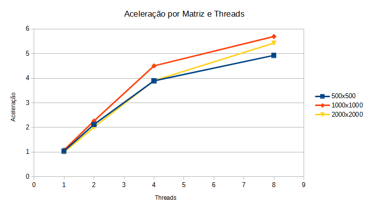
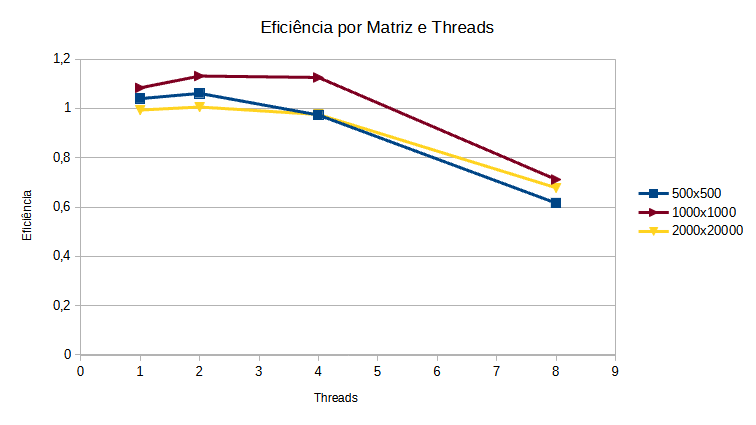

# Lab 3 - Programação Concorrente 2024.01
Aluno: Diego Vasconcelos Schardosim de Matos
Dre: 120098723

Professora: Silvana Rossetto

## Pre requisitos

Compilador gcc esteja instalado no sistema.

## Enunciado
Projetar e implementar uma solução concorrente para o problema de multiplicação
de matrizes, coletar informações sobre o seu tempo de execução, e calcular o ganho de
desempenho obtido.

- As matrizes de entrada e saı́da serão do tipo float, com N linhas e M colunas.
- As matrizes de entrada devem ser carregadas de arquivos binários previamente
gerados, onde os dois primeiros valores (do tipo inteiro) indicam as dimensões da
matriz (N e M), e os demais elementos (do tipo float) são a sequência de valores
da matriz.
- As matrizes deverão ser representadas internamente como vetores de float (variável
do tipo ponteiro, alocada dinamicamente).
- A matriz de saı́da deverá ser escrita em um arquivo binário, no mesmo formato
dos arquivos de entrada.
- O programa deverá receber como entrada, na linha de comando, os nomes dos
arquivos de entrada e de saı́da, e a quantidade de threads de processamento.
- O programa deverá incluir chamadas de tomada de tempo de execução interna
do programa, separando as partes de inicialização, processamento e finalização
do programa.

## Solução
Foram escritos três programas e um script em bash para automatizar o relatório, os programas são responsáveis respectivamente por:

### Programa 1: Gera matriz
Este programa recebe três argumentos: número de linhas M, número de colunas N e o arquivo de saída da matriz. Sua chamada é

```bash
    gera-matriz <numero_linhas> <numero_colunas> <arquivo_saida.bin>
```
  
E é responsável por gerar uma nova matriz de tamanho MxN com números reais aleatórios entre um intervalo mínimo e máximo (por padrão -1000 até 1000) e exportar para um arquivo no caminho fornecido.

### Programa 2: Multiplicação Matrizes Sequencial
Este programa recebe três argumentos: arquivo binário da matriz A, arquivo binário da matriz B, e arquivo binário para matriz resultante C. Sua chamada é dada por

```bash
    matvet-sequencial <matriz_a.bin> <matriz_b.bin> <matriz_resultante.bin>.
```

É responsável por realizar o produto matricial de forma sequencial e seu resultado será usado posteriormente para corretude do programa concorrente.

Durante a compilação do programa o usuário pode comentar (ou não) a variável de compilação "TO_CSV" para ligar/desligar a impressão do tempo de execução da multiplicação matricial num formato válido csv. Isto é útil no final do lab para gerar uma tabela com relatório dos tempos de execução de cada programa com diferentes argumentos.

### Programa 3: Multiplicação Matrizes Concorrente
Este programa recebe três argumentos: arquivo binário da matriz A, arquivo binário da matriz B, números de threads e arquivo binário para matriz resultante C. Sua chamada é dada por

```bash
    matvet-sequencial <matriz_a.bin> <matriz_b.bin> <numero_threads> <matriz_resultante.bin>.
```

É responsável por realizar o produto matricial de forma concorrente. Para resultados mais coerentes é indicado utilizar como argumentos de entrada da matriz A e B os mesmos do programa sequencial.

Durante a compilação do programa o usuário pode comentar (ou não) a variável de compilação "TO_CSV" para ligar/desligar a impressão do tempo de execução da multiplicação matricial num formato válido csv. Isto é útil no final do lab para gerar uma tabela com relatório dos tempos de execução de cada programa com diferentes argumentos.


### Programa 4: Script Gera Relatório
Este script em .sh ou .bat (incompleto) é responsável por executar os programas sequencial e concorrente por, pelo menos, 3 vezes para cada parametro diferente solicitado pelo exercício.

A princípio são gerados 3 grupos de matrizes: 500x500, 1000x1000 e 2000x2000. O programa sequencial é executado 3x para cada matriz diferente, e o concorrente é executado 3x para cada grupo de threads diferentes: 1, 2, 4 e 8. Os programas sempre usam as mesma matrizes de entrada de seu grupo correspondente.

Para obter o resultado esperado do relatório, é necessário que os programas estejam com "TO_CSV" habilitados e a saída o shell seja redirecionado para um arquivo .csv, como "relatorio/amostras-linux.csv", ex:

```cmd
    run.sh > relatorio/amostras-linux.csv
```

OBS: No ambiente Linux é necessário que o .sh tenha permissão para ser executado.

## Relatório
Os resultados de tempo de execução para os programas sequencial e concorrente foram **inicialmente** obtidos usando a máquina Windows (como detalhada mais adiante) seguindo os passos abaixo:

1. Compilado os programas e gerado as matrizes de entrada.
2. Executado comando run.bat como descrito acima.
3. Através de uma planilha, usando Libre Office Calc, foi feito a média das amostras conforme solicitado pelo exercício.
4. Com a média calculada foi feito o cálculo da aceleração e eficiência.
5. Ao final foi gerado dois gráficos de aceleração e eficiencia com a tabela final obtida (os gráficos também foram gerados dentro do Libre Office Calc).

Os relatórios foram feitos nas seguintes máquinas:

Máquina Desktop:
- Processador: AMD Ryzen 5 1600X Six-Core 
- RAM: 16 GB
- GPU: GTX 1660 6GB
- Executado em Disco SSD
- Windows 10 Pro 64 bits

Máquina Notebook (Relatório incompleto):
- Processador: Quad Core Intel Atom x5-Z8350
- RAM: 4 GB
- GPU: Integrado
- Executado em Disco eMMC
- Debian 12 64 bits XFCE



O gráfico de aceleração mostra que quanto maior o número de threads a aceleração do programa concorrente aumenta.



O gráfico de eficiência nos indica que o programa concorrente perde Eficiência para threads maior que 4 para as configurações dadas.
