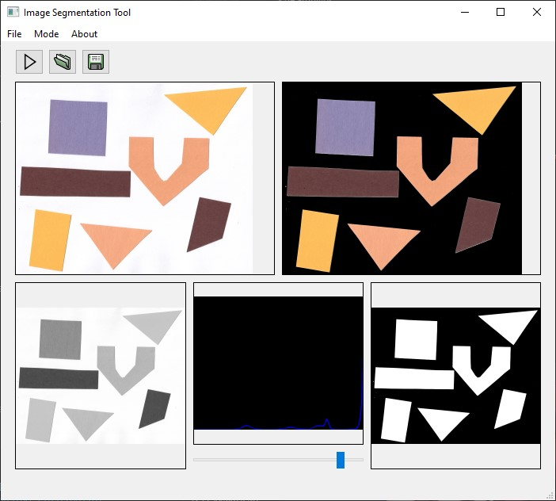

# Final Project - Concurrency Programming

This project focuses on applying concurrency to image segmentation using the Thresholding method. The program, built with Qt6, allows users to select an image from disk, choose a threshold value, and apply it to the original image. The result is a filtered image where the target (e.g., a person) stands out from the background.

## How to build

To build the project, follow these steps:

1. Install the following dependencies:
    - CMake
    - Qt6
    - OpenCv 4.10
2. Ensure that the environment paths are correctly set
3. Run the following commands in your terminal

```
    mkdir build && cd build
    cmake ..
    cmake --build . --config Release
```

Use the provided images on examples/ directory to quickly test the program. 



